# Day 01 - What Happens When a Program Runs

## 1. Objective

The core objective of this study is to answer a fundamental computer systems question:

> **"What actually happens when a program runs?"**

We trace the complete execution pathway from high-level source code (Java) down through software abstractions, runtime engines, operating system processes, threads, virtual memory, kernel interfaces, and physical hardware.

---

## 2. Core Mental Model

The diagram below illustrates the end-to-end execution path from source code to hardware execution.

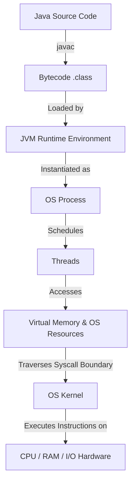

---

## 3. From Java Source to CPU

To understand how high-level logic reaches physical execution units, consider the transformation phases:

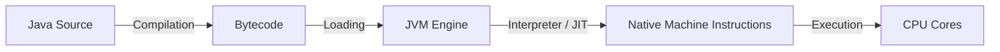

### Code Example

```java
public class Main {
    public static void main(String[] args) {
        System.out.println("Hello");
    }
}
```

### Execution Commands

```bash
javac Main.java
java Main
```

### Command Mechanics

- **`javac Main.java`**: Invokes the Java compiler. It parses the human-readable source file (`Main.java`), performs syntax analysis and type checking, and emits platform-independent intermediate instructions called bytecode into `Main.class`.
- **`java Main`**: Launches the Java Virtual Machine runtime executable as a new operating system process. The JVM loads `Main.class`, initializes runtime data areas, interprets/compiles the bytecode into architecture-specific machine code, and requests execution from the OS kernel.

---

## 4. JVM

The Java Virtual Machine (JVM) acts as an abstraction layer between bytecode and the host operating system:

- **Runtime Environment**: The JVM provides a managed execution environment, handling memory allocation, garbage collection, thread management, and security checks.
- **Bytecode Execution**: Bytecode is an instruction set designed for a stack-based virtual machine, independent of underlying host CPU architectures (x86_64, ARM, etc.).
- **OS Process Instance**: The JVM itself is a native OS process compiled for the host OS (e.g., a C++ application binary such as `java` on Linux/Windows).
- **Interpretation & JIT Compilation**:
  - The JVM initially executes bytecode using an **interpreter**, reading and executing bytecode instructions line-by-line with zero compilation delay.
  - During execution, the JVM profiles code execution using counters to detect **"hotspots"** (frequently executed methods or loops).
  - The **Just-In-Time (JIT) Compiler** asynchronously compiles these hotspots directly into highly optimized host native machine code in memory.
  - *Note*: JIT is not a simplistic "Java always compiles at runtime" step; it is an adaptive, dynamic hybrid system combining baseline interpretation with profile-guided native compilation.

---

## 5. Program vs Process

A fundamental distinction exists between static executable representation on disk and an active execution context in memory:

| Attribute | Program | Process |
| :--- | :--- | :--- |
| **Definition** | A static representation of executable code and associated resources, typically stored in files. | A running execution instance managed by the operating system. |
| **State** | Static byte contents stored on filesystem storage. | Dynamic execution state (PID, CPU registers, stack, heap, file descriptors). |
| **OS Context** | Passive entity managed by the filesystem. | Active entity managed by the OS kernel scheduler and memory manager. |

### Relationship: `Main.class != running process`

`Main.class` is simply a file containing bytecode sequence definitions. A running process is a dynamic entity instantiated by the OS kernel containing memory structures, threads, and assigned OS resources. One program can spawn multiple independent running processes simultaneously:

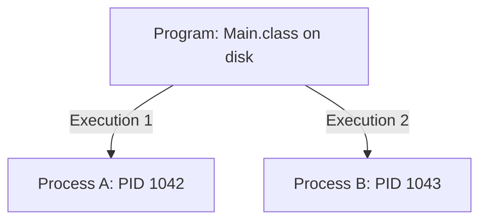

---

## 6. Process

A process is an operating-system abstraction representing an executing program instance together with associated execution state and resources.

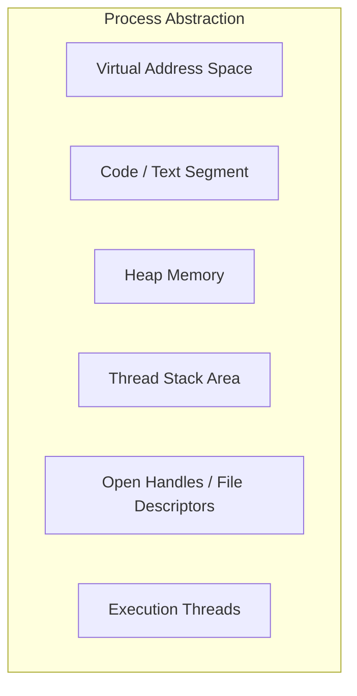

> [!NOTE]
> **Conceptual Model Disclaimer**: The diagram above is a simplified conceptual abstraction. Exact process implementation details, data structures, and layout schemas are OS-specific (e.g., Linux task management structures vs. Windows `EPROCESS`).

---

## 7. Threads

A thread represents an execution context that can be scheduled independently by the operating system.

- **Execution Context**: A thread represents a single sequential control flow within a process.
- **Shared Resources**: Threads belonging to the same process share the process's virtual address space, heap memory, global variables, and open resource handles (file descriptors, sockets).
- **Private Execution State**: Each thread retains its own private execution state, including its program counter (PC), CPU registers, and call stack.

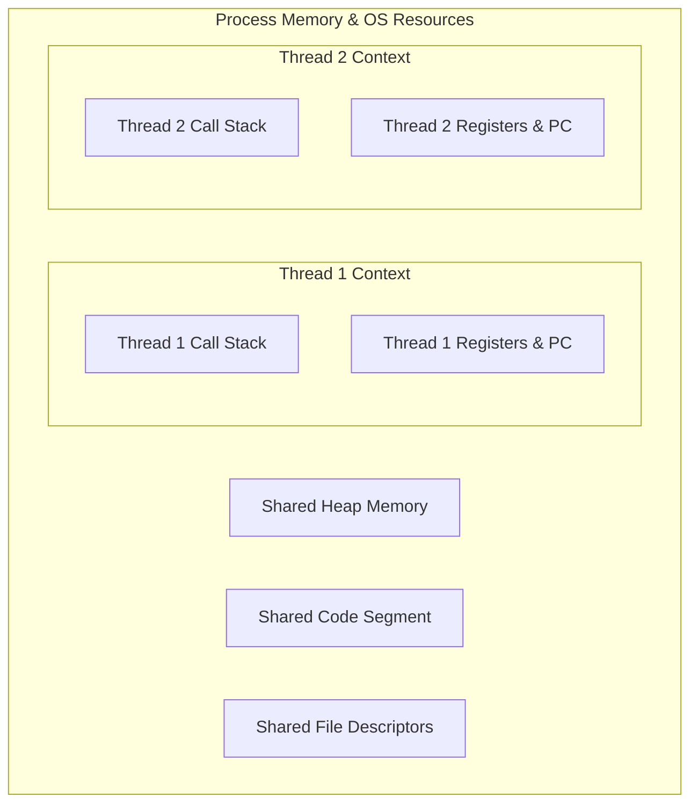

> [!NOTE]
> **Terminology Note**: Operating system thread implementations differ across platforms. Linux scheduling terminology and internal task representation become more precise in later lessons.

---

## 8. Process vs Thread

| Conceptual Aspect | Process Context | Thread Context |
| :--- | :--- | :--- |
| **Primary Role** | Unit of resource ownership and memory isolation boundary. | Unit of execution scheduling and instruction flow. |
| **Memory Isolation** | Isolated virtual address space per process. | Shared address space within the parent process. |
| **Switching Work** | Process switching may involve changing address-space context in addition to execution state. | Thread switching within the same process shares the address space, so address-space-related setup can be avoided. |
| **Fault Boundary** | High isolation (a fault in one process does not directly corrupt another). | Shared memory space (an unhandled exception or crash in one thread can affect the entire process). |

---

## 9. CPU Scheduling

CPU scheduling is required because physical hardware execution resources (CPU cores) are finite, whereas active software execution demands (runnable threads) typically exceed core counts.

### Scenario Example: 4 CPU Cores vs. 100 Runnable Threads

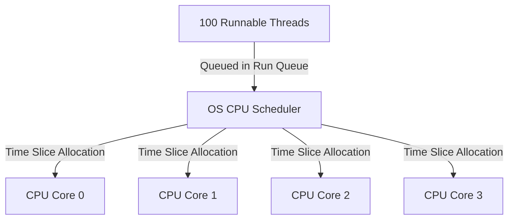

### Scheduling Concepts & Linux Scheduler Context

- **Runnable Work**: Threads in a ready state waiting for access to a processing core.
- **Scheduling Decisions**: The Linux scheduler selects runnable tasks for CPU execution. Modern Linux kernels (including Linux 6.18 in our WSL2 environment) use EEVDF-based (Earliest Eligible Virtual Deadline First) scheduling for the fair scheduling class, while other scheduling classes handle real-time and idle policies. *(Note: The Completely Fair Scheduler (CFS) served as the historic predecessor in earlier Linux kernel releases).*
- **CPU Contention**: Competition among multiple threads for available physical execution slots.
- **Latency**: The time a thread spends waiting in the runnable queue before being scheduled on a core.
- **Throughput**: The rate of completed instructions or work tasks per unit time.
- **Context Switching**: The mechanism invoked when preempting a running thread to give another thread core execution time.

---

## 10. Context Switching

A context switch is the process of storing the execution state of a running thread so that execution can be resumed later, and restoring the state of another thread.

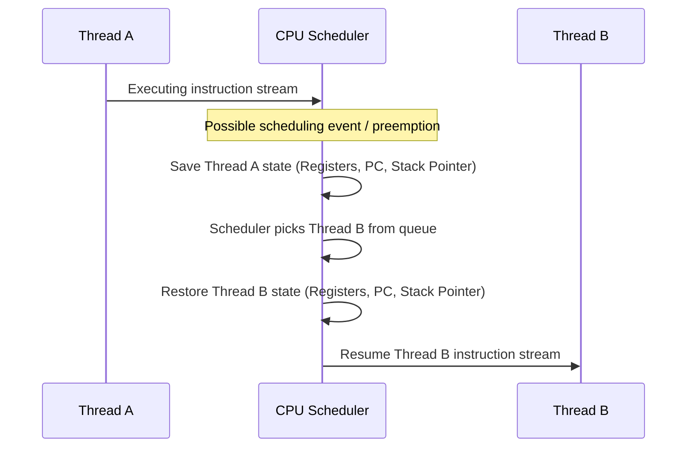

> [!IMPORTANT]
> **Overhead**: Context switching incurs CPU overhead. Scheduling events arise from various sources (such as I/O blocking, explicit yields, resource contention, or timer-based preemption). Direct costs include saving and loading CPU register states. Indirect costs include CPU cache pollution, pipeline invalidation, and memory translation cache updates.

---

## 11. Virtual Memory

Virtual memory provides an abstraction layer that presents each process with the illusion of a private, contiguous block of memory, isolating processes from physical RAM layout details and from each other.

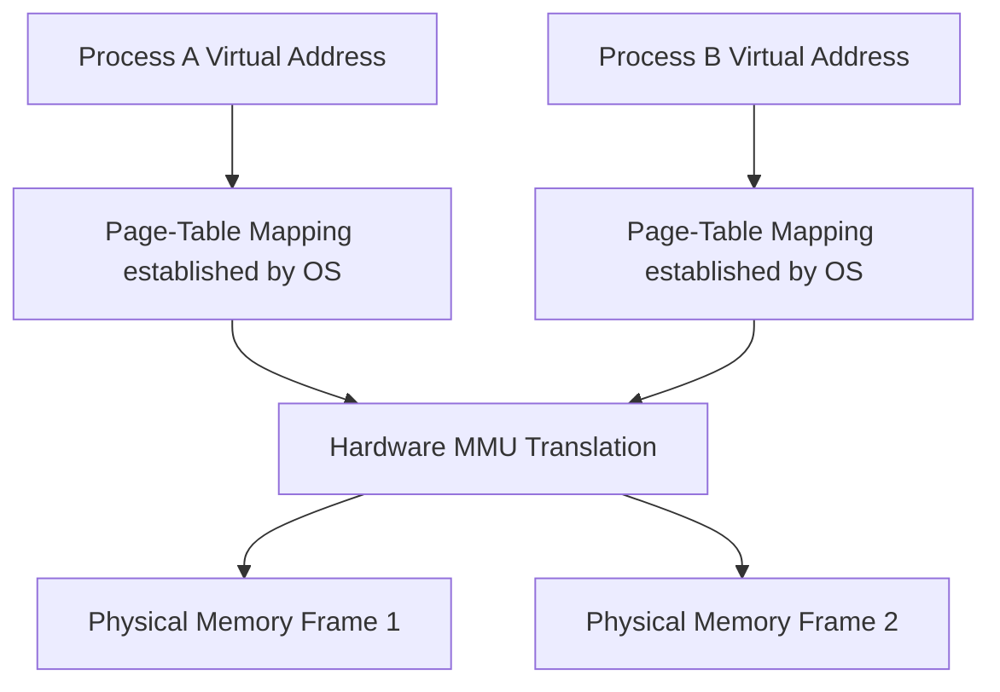

### Role Separation: OS vs Hardware MMU

- **OS Role**: The operating system kernel manages and establishes memory mappings (page tables), allocating physical pages to virtual address ranges.
- **Hardware MMU Role**: The hardware Memory Management Unit (MMU) performs the fast, hardware-level address translation during CPU instruction execution using those OS-configured mappings.

### Isolation & Abstraction Benefits

1. **Isolation**: Process A cannot read or write to Process B's memory addresses because its virtual addresses translate only to physical pages allocated specifically to Process A.
2. **Abstraction**: Applications execute assuming a standard, contiguous memory address layout without managing physical RAM fragmentation or location constraints.

*Note: Detailed mechanics such as multi-level page tables, TLB caching, page faults, and huge pages belong to future lessons.*

---

## 12. System Calls

When an application requires hardware or operating system services, it cannot access hardware directly. It must invoke a **system call** (syscall) to transition execution into the kernel.

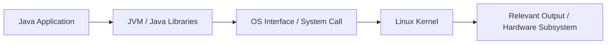

### Execution Example

Consider executing `System.out.println("Hello");` in Java:
1. Java application code calls `PrintStream.println()`.
2. The JVM / standard Java class library processes the call and delegates to native OS interface mechanisms.
3. On a standard Linux/OpenJDK implementation path, this delegates to C standard library routines (e.g., `libc`) which execute a system call (e.g., `write()`) targeting stdout file descriptor `1`.
4. The kernel handles the relevant output subsystem, which may involve a terminal, pseudo-terminal (such as in WSL2), or stream buffer.

---

## 13. User Space vs Kernel Space

Modern operating systems enforce hardware-assisted privilege separation to maintain system stability and security.

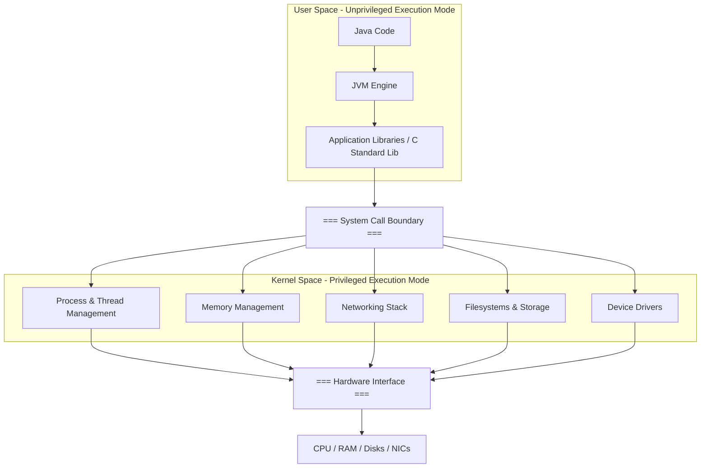

> [!NOTE]
> **Precision Note**: Not every operating system service resides inside kernel space (e.g., user-space daemons, systemd services, or microkernel modules execute in user space). Kernel space refers specifically to privileged CPU execution mode controlling core system resources.

---

## 14. Complete Mental Model

The following diagram connects the complete execution flow from high-level application down to physical hardware, followed by a preview of cloud infrastructure layering.

```mermaid
graph TD
    subgraph Core Execution Flow
        App[Java Application] --> JVM[JVM Engine]
        JVM --> Proc[OS Process]
        Proc --> Thr[Threads]
        Thr --> OS[Operating System]
        OS --> Kern[Kernel]
        Kern --> HW[Physical Hardware]
    end

    subgraph Infrastructure Layering Preview [PREVIEW - Future Topics]
        HW2[Physical Hardware] --> Virt[Hypervisor / Virtualization]
        Virt --> VM[Virtual Machine Instance]
        VM --> HostOS[Guest OS]
        HostOS --> ContRuntime[Container Runtime]
        ContRuntime --> Container[Container Instance]
        Container --> ContApp[Containerized Application]
    end
```

> [!NOTE]
> **Preview Context**: The infrastructure diagram represents *one common deployment model* (Virtual Machine hosting Container instances). Advanced container architectures and cloud virtualization variations will be explored in future lessons.

---

## 15. Backend Engineering Connection

Understanding execution mechanics is critical for backend application development. Consider a simplified conceptual view of a web service request:

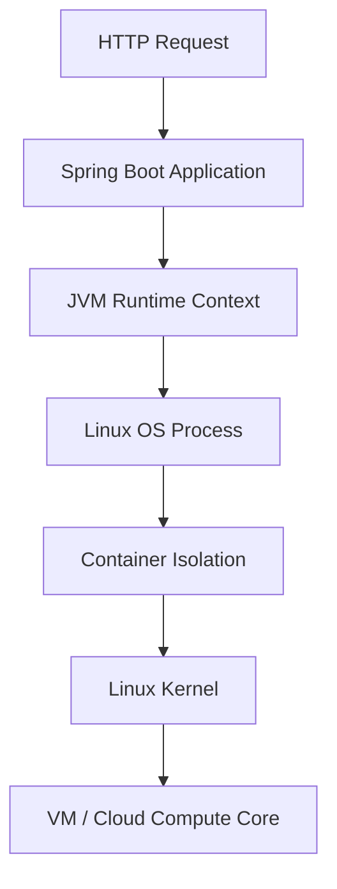

### Why Backend Engineers Must Understand Lower Layers

- **Concurrency & Scaling**: Misunderstanding thread overhead leads to misconfigured thread pools, thread exhaustion, and latency spikes.
- **Resource Management**: High heap utilization directly affects JVM GC pauses, which manifest as slow API responses or container OOM (Out Of Memory) kills by the Linux kernel.
- **Performance Optimization**: Efficient I/O handling (blocking vs non-blocking system calls) dictates maximum application throughput.

---

## 16. Production Debugging Perspective

When responding to an incident where an "API is slow", application-level code is only one of many potential root causes.

### Diagnostic Branching Model

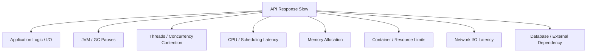

> [!IMPORTANT]
> This structure represents a **diagnostic branching model** for systematic troubleshooting across system boundaries. Production diagnosis requires evaluating multiple potential layers rather than assuming every performance problem flows sequentially through all layers.

---

## 17. Key Takeaways

1. **Source to Bytecode**: `javac` transforms human-readable Java code into platform-independent bytecode (`.class`).
2. **Managed Runtime**: The JVM is an OS process that executes bytecode using a dynamic combination of interpretation and JIT compilation.
3. **Programs vs Processes**: A program is static code on disk; a process is an active, isolated execution instance in memory.
4. **Threads as Schedulable Units**: Processes act as resource containers; threads are independent execution contexts scheduled by the OS.
5. **CPU Scheduling & Contention**: The OS scheduler multiplexes runnable threads onto finite CPU cores, introducing latency and context switching overhead.
6. **Virtual Memory Isolation**: OS-configured page tables and hardware MMU translation isolate process memory and present a contiguous address layout.
7. **System Calls & Space Separation**: Unprivileged user-space code must cross the system call boundary into kernel space to access hardware and OS resources.
8. **Diagnostic Depth**: Performance debugging requires a branching diagnostic approach across application, JVM, OS process, thread, kernel, and hardware boundaries.

---

## 18. Questions Generated

The conceptual foundation established in Day 1 naturally introduces deeper systems questions for future lessons:

- How does Linux actually create a process?
- What are PIDs and PPIDs?
- What happens during `fork()` and `exec()` system calls?
- How does the Linux CPU scheduler work under the hood?
- What are process states (Running, Sleeping, Stopped, Zombie)?
- How does virtual memory translation actually work (Page Tables, MMU, TLB)?
- How does JVM memory allocation interact with OS native memory?
- How do Linux containers isolate processes (namespaces, cgroups)?

---

## 19. Day 1 Status

- **Conceptual Foundation**: Completed.
- **Practical Linux Observation**: Completed.
- **Research Gap**: NOT established.
- **Research Observation**: Recorded for later validation.
