# Day 02 - Linux Process Model

How Linux creates, identifies, executes, manages, and terminates processes.

---

## 1. Objective

The central question for Day 2 is:

> **How does Linux create, identify, execute, manage, and terminate processes?**

### Relationship to Day 1

Day 1 established the top-to-bottom macro mental model of application execution:

$$\text{Application} \longrightarrow \text{JVM} \longrightarrow \text{Process} \longrightarrow \text{Threads} \longrightarrow \text{Operating System} \longrightarrow \text{Hardware}$$

Day 2 inspects the operating-system **process layer** in detail:

$$\text{Process} \longrightarrow \text{PID / PPID} \longrightarrow \text{fork()} \longrightarrow \text{exec()} \longrightarrow \text{Execution} \longrightarrow \text{wait()} \longrightarrow \text{exit()} \longrightarrow \text{Termination}$$

Building a precise process-lifecycle mental model provides the foundation required to later understand:
- Managed runtime behavior (such as the JVM)
- Backend application servers
- Container isolation mechanisms
- OS-level resource control
- Cloud compute infrastructure

---

## 2. PID

A **Process Identifier (PID)** is an integer handle assigned by the operating system kernel to identify an active process instance.

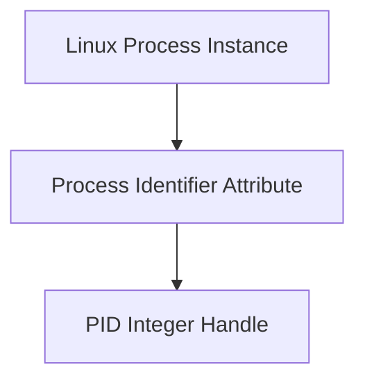

> [!IMPORTANT]
> **Key Distinction**: A PID is an identifier assigned to a process, not the process entity itself. 

### Examples of PID Usage in Commands

- `ps -p <PID>`: Queries OS process status for a specific PID.
- `cat /proc/<PID>/status`: Reads kernel-synthesized process state for a specific PID.
- `kill <PID>`: Sends a signal to the process identified by that PID.

*Note: Kernel PID allocation algorithms and PID namespace mapping mechanics belong to future lessons.*

---

## 3. PPID

A **Parent Process ID (PPID)** identifies the parent process that created a given process.

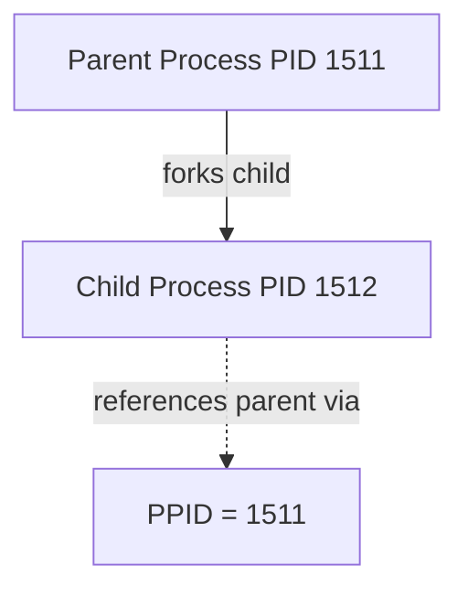

- When a process creates a new process, the creating process becomes the **parent**, and the newly created process becomes the **child**.
- The child process stores the PID of its parent as its **PPID**.
- Parent-child process relationships form an observable process hierarchy across the operating system.

---

## 4. Process Hierarchy

Linux processes are organized in a tree-like hierarchy rooted at the initial user-space process (PID 1).

### Observed Process Hierarchy (`pstree -p` Snapshot)

During our experiment in the WSL2 Ubuntu environment, `pstree -p` revealed the following process tree:

```text
systemd(1)─┬─agetty(215)
           ├─containerd(221)─┬─{containerd}(236)
           │                 ├─{containerd}(237)
           │                 ├─{containerd}(238)
           │                 ├─{containerd}(239)
           │                 ├─{containerd}(240)
           │                 ├─{containerd}(253)
           │                 ├─{containerd}(259)
           │                 └─{containerd}(275)
           ├─cron(166)
           ├─dbus-daemon(167)
           ├─dockerd(311)─┬─{dockerd}(314)
           │              ├─{dockerd}(315)
           │              ├─{dockerd}(316)
           │              ├─{dockerd}(317)
           │              ├─{dockerd}(318)
           │              ├─{dockerd}(319)
           │              ├─{dockerd}(323)
           │              ├─{dockerd}(324)
           │              └─{dockerd}(338)
           ├─init-systemd(Ub(2)─┬─SessionLeader(561)───Relay(563)(562)───bash(563)─┬─pstree(1699)
           │                    │                                                  └─top(889)
```

### Hierarchy Insights

- **PID 1 (`systemd`)**: Sits at the root of the user-space process tree.
- **System Daemons**: Services such as `cron`, `dbus-daemon`, `dockerd`, and `containerd` run as child processes under the system hierarchy.
- **Interactive Shell Ancestry**: The interactive `bash` shell (PID 563) spawned `pstree` (PID 1699) and `top` (PID 889) as child processes.
- **Thread Notations**: Entries surrounded by braces (e.g., `{dockerd}(314)` or `{containerd}(236)`) represent **threads** running within those process contexts in the `pstree` output format. 

*Note: Thread scheduling and memory sharing mechanics will be studied in Day 3.*

---

## 5. `fork()`

`fork()` is the primary POSIX system call used to create a new process on Unix-like operating systems.

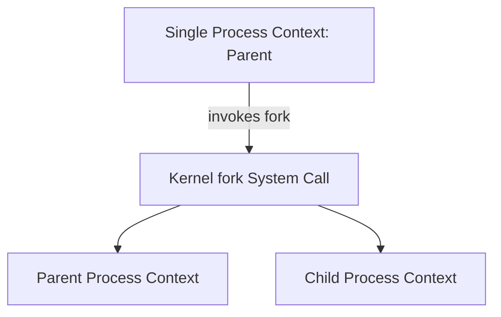

### Execution Mechanics

- **Before `fork()`**: Exactly one process is executing.
- **After successful `fork()`**: Two distinct processes exist—the parent process and the newly created child process.
- **Concurrent Continuation**: Both processes resume execution from the exact instruction following the `fork()` call.

### `fork()` Return Values

| Execution Context | `fork()` Return Value | Meaning |
| :--- | :--- | :--- |
| **Parent Process** | `Child PID` ($> 0$) | Receives the PID of the newly created child process. |
| **Child Process** | `0` | Receives 0, indicating execution is within the child context. |
| **Failure** | `-1` | Process creation failed (e.g., resource exhaustion); no child is created. |

> [!NOTE]
> `fork()` does not perform an immediate physical copy of all parent RAM contents. Instead, the child receives a copy of the parent's virtual memory mappings, managed via **Copy-on-Write (COW)**.

---

## 6. Copy-on-Write (COW)

Copy-on-Write is an optimization mechanism that defers copying physical memory pages during process creation.

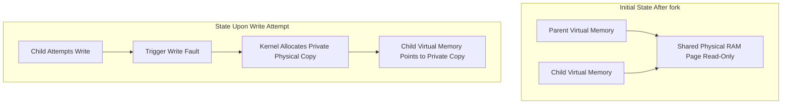

### Conceptual Mechanics

1. Immediately following a `fork()`, the parent and child processes share the exact same physical memory pages marked read-only.
2. If either process performs a read operation, execution proceeds without memory allocation overhead.
3. When either process attempts to perform a write operation to a shared page, the MMU hardware triggers a protection fault. The kernel intercepts this fault, allocates a new physical frame, copies the page contents, updates the writing process's mapping, and resumes execution.

*Note: Detailed page-table flags, fault handling routines, and TLB invalidations belong to future memory management lessons.*

---

## 7. Fork Experiment

To observe `fork()` return values and process creation in practice, we compiled and executed a C demonstration program (`fork-demo.c`).

### Source Code (`fork-demo.c`)

```c
#include <stdio.h>
#include <unistd.h>

int main()
{
    pid_t pid = fork();

    if (pid < 0)
    {
        perror("fork");
        return 1;
    }

    if (pid == 0)
    {
        printf("Child: PID=%d, PPID=%d\n", getpid(), getppid());
    }
    else
    {
        printf("Parent: PID=%d, Child PID=%d\n", getpid(), pid);
    }

    return 0;
}
```

### Compilation & Execution Commands

```bash
nano fork-demo.c
gcc fork-demo.c -o fork-demo
ls -l fork-demo
./fork-demo
```

### Actual Execution Output

```text
Parent: PID=1511, Child PID=1512
Child: PID=1512, PPID=1511
```

### Experimental Diagram

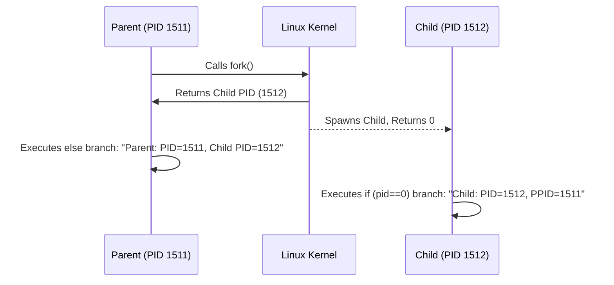

### Empirical Observations

- The parent process executed with **PID 1511**.
- The newly created child process was assigned **PID 1512**.
- `fork()` returned **1512** to the parent process.
- `fork()` returned **0** to the child process, directing control flow into the `pid == 0` conditional block.
- The child process queried its parent PID (`getppid()`), which returned **1511**.
- *Note*: The relative order of stdout printing between parent and child is non-deterministic because both processes are independently schedulable execution contexts.

---

## 8. `exec()`

The `exec()` family of system calls replaces the calling process's current program image with a new program executable image.

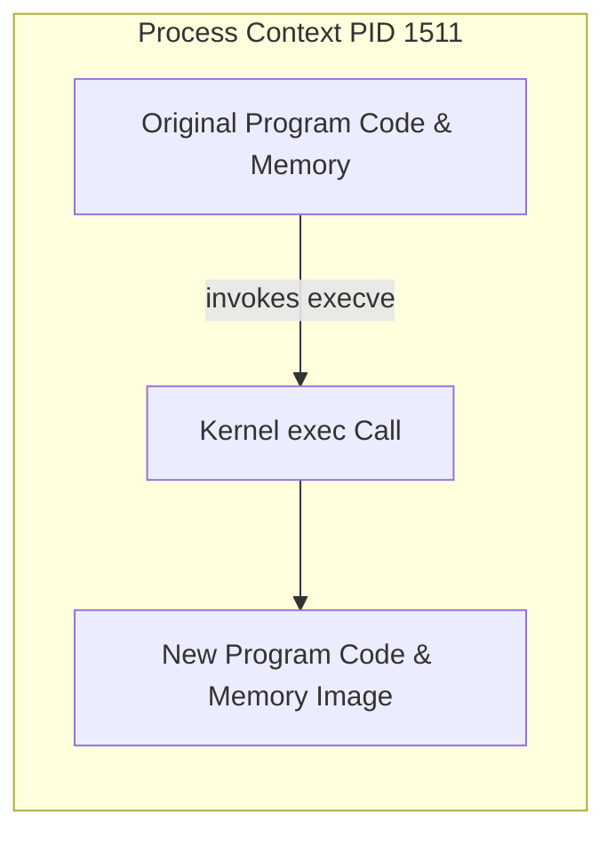

### Core Distinction: `fork()` vs. `exec()`

- **`fork()`**: Creates a **new process** (new PID) running a copy of the caller's program context.
- **`exec()`**: Replaces the **program image** within the *existing* process context (retains the same PID).

---

## 9. Shell Command Execution Model

A traditional Unix command shell executes external commands by combining `fork()` and `exec()`.

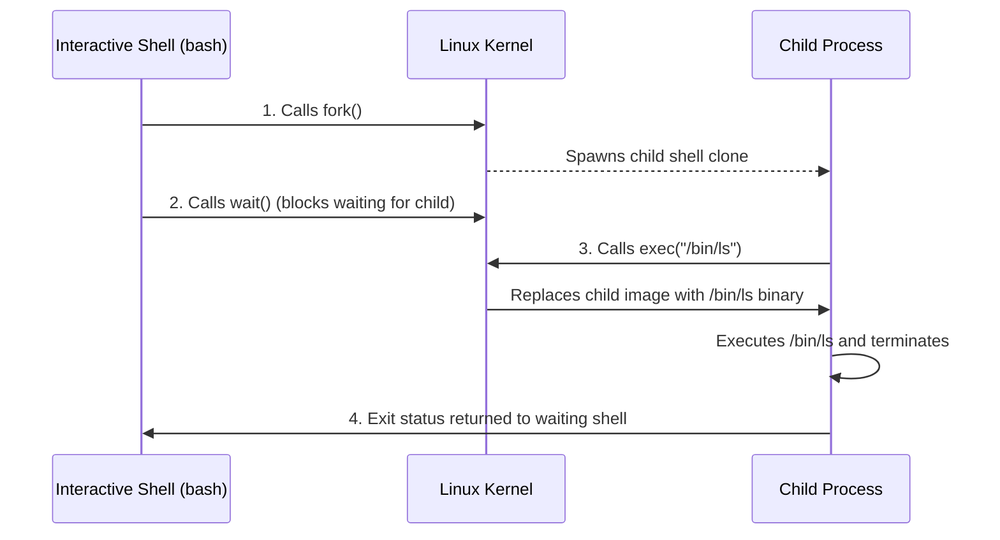

> [!NOTE]
> This represents a simplified conceptual model of command execution. Shell built-in commands (e.g., `cd`, `echo`, `exit`) execute directly within the shell process without spawning child processes via `fork()` and `exec()`.

---

## 10. `wait()`

`wait()` (and related system calls like `waitpid()`) allows a parent process to suspend execution until a child process terminates, retrieving the child's exit status.

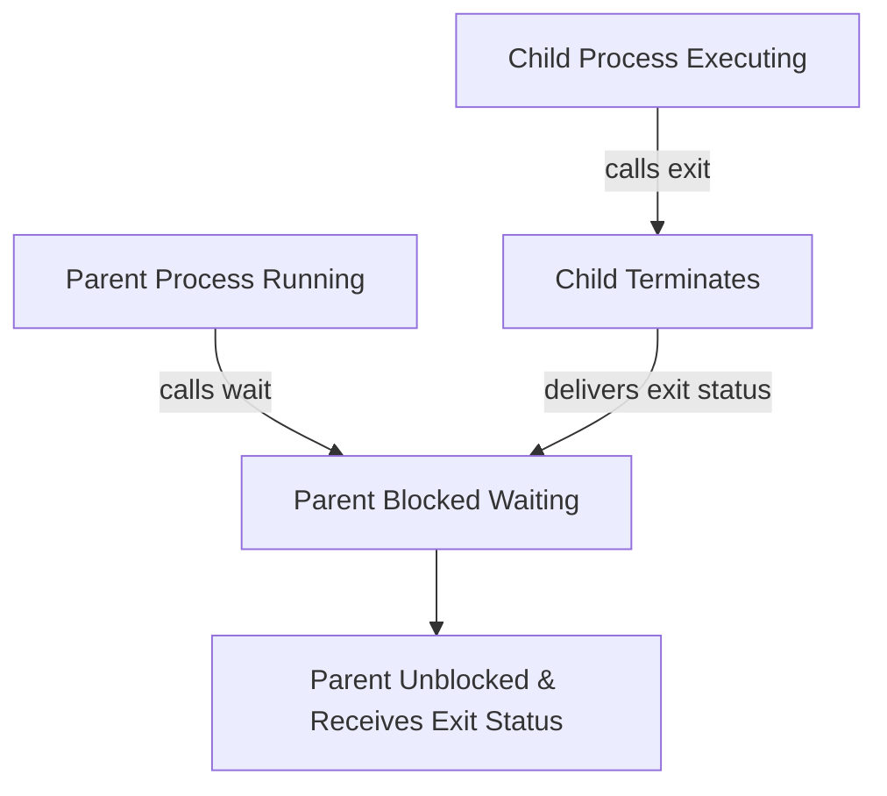

- If a child process finishes execution before the parent calls `wait()`, the kernel holds the child's exit code until the parent collects it.
- Proper parent waiting prevents the accumulation of terminated process records.

---

## 11. `exit()`

`exit()` terminates the calling process, releasing its allocated memory, open file descriptors, and OS resources back to the kernel.

- Upon calling `exit()`, the process transitions out of an executing state.
- The kernel retains a minimal process table record (containing PID, exit code, and execution metrics) until the parent process acknowledges termination via `wait()`.

---

## 12. Zombie Process

A **zombie process** is a process that has completed execution via `exit()`, but whose exit status has not yet been collected by its parent process via `wait()`.

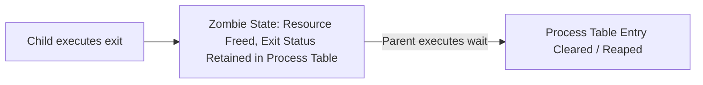

### Critical Zombie Facts

1. **Not Executing**: A zombie process is not running instructions and does **not** consume CPU cycles or physical RAM.
2. **Process Table Slot Consumption**: A zombie consumes a PID entry and a slot in the OS kernel process table.
3. **Misconception Warning**: A zombie process is **not** a "stuck running process". It is a terminated process awaiting status collection by its parent.

---

## 13. Orphan Process

An **orphan process** occurs when a parent process terminates before its child process has completed execution.

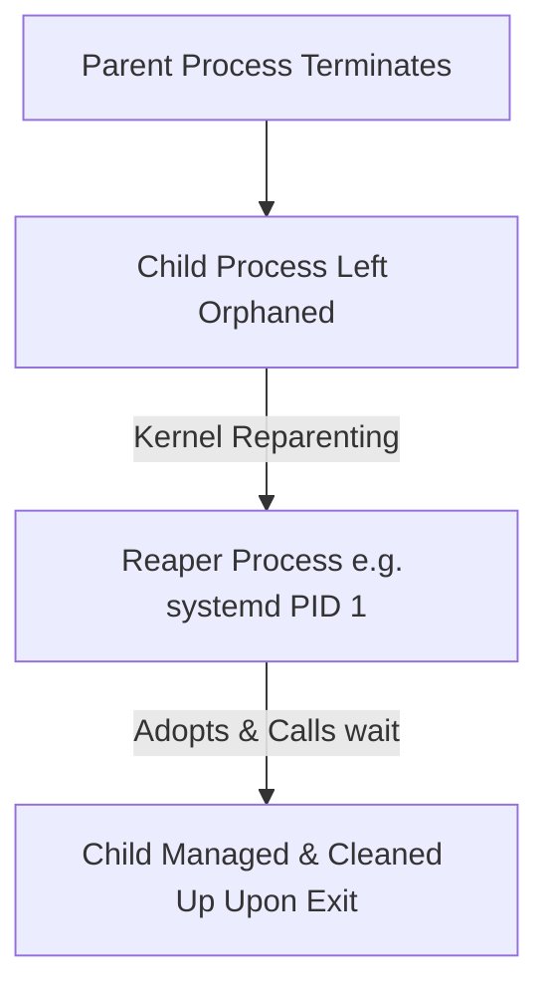

### Reparenting Mechanics

- When a parent process dies, the Linux kernel automatically reparents orphaned child processes to a designated adoption/reaper process (historically PID 1 `systemd` or an assigned subreaper).
- The reaper process periodically invokes `wait()` to collect exit statuses when orphaned children eventually terminate, preventing permanent zombies.

### Zombie vs. Orphan Comparison

| Attribute | Zombie Process | Orphan Process |
| :--- | :--- | :--- |
| **Termination Order** | Child terminates first. | Parent terminates first. |
| **Execution State** | Terminated (no CPU/RAM consumption). | Active (currently running or runnable). |
| **Parent State** | Parent is still alive, but hasn't called `wait()`. | Parent process has exited and no longer exists. |
| **Resolution** | Parent must call `wait()`, or parent termination triggers reparenting. | Automatically adopted by OS reaper process (PID 1). |

---

## 14. Process States

Linux manages processes across several execution states during their lifecycle.

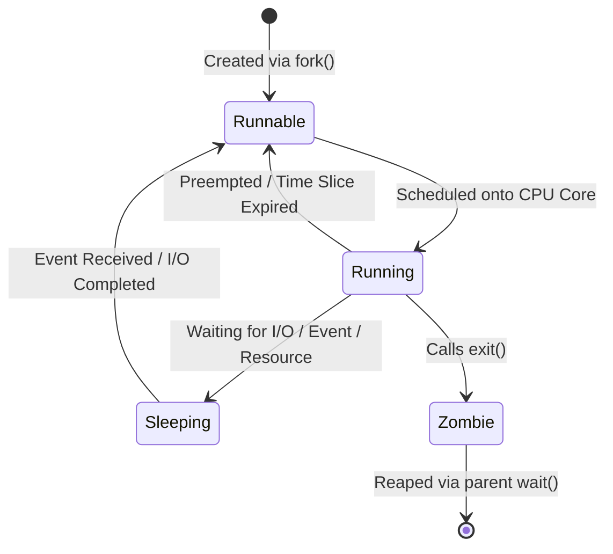

> [!NOTE]
> **Simplified Model Disclaimer**: The state machine above is a conceptual model. The Linux kernel maintains specific detailed process flags (`TASK_RUNNING`, `TASK_INTERRUPTIBLE`, `TASK_UNINTERRUPTIBLE`, `TASK_STOPPED`, `TASK_TRACED`, `EXIT_ZOMBIE`, `EXIT_DEAD`).

### Core State Definitions

- **Running**: Currently executing instructions on a physical CPU core.
- **Runnable**: Ready for execution, waiting in an OS run queue for an available CPU core.
- **Sleeping**: Waiting for an external event, timer, or I/O operation to complete before becoming eligible to run.
- **Zombie**: Execution completed; awaiting termination status collection by parent.

---

## 15. Running vs. Runnable

Understanding the boundary between *Running* and *Runnable* is fundamental to hardware resource reasoning.

### Scenario: 4 CPU Cores vs. 100 Runnable Tasks

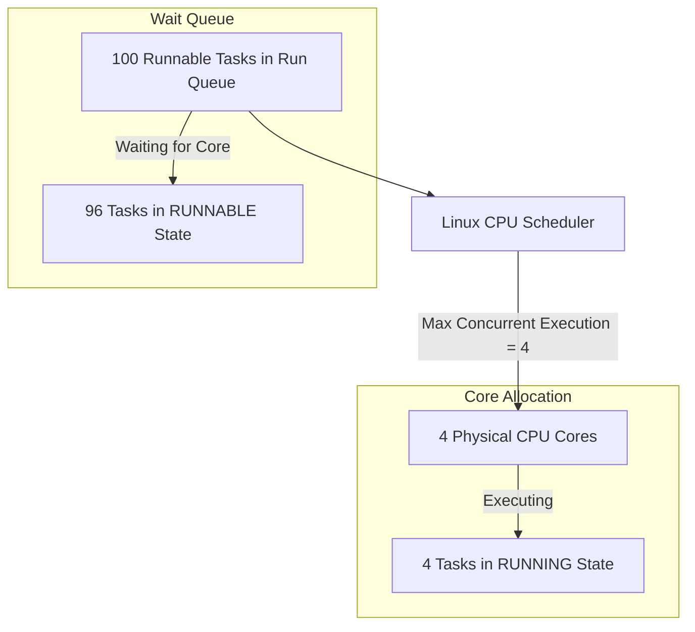

- **Runnable**: 96 tasks are ready to execute instructions but are queued waiting for CPU scheduling.
- **Running**: Exactly 4 tasks are executing on hardware cores simultaneously.
- **Constraint**: Hardware core count establishes the upper limit for concurrent parallel instruction execution.

---

## 16. Sleeping

Processes transition into a **Sleeping** state when they cannot proceed without an external event, resource, or I/O completion.

- **Resource Efficiency**: A sleeping process is removed from CPU run queues, allowing the OS scheduler to utilize CPU cores for other runnable tasks without wasting cycles polling.
- **Sleep Triggers**: File system reads/writes, network socket operations, explicit sleep timers (`sleep`), or waiting for child process exit (`wait`).

---

## 17. JVM Connection

Connecting process lifecycle mechanics to Java backend application execution:

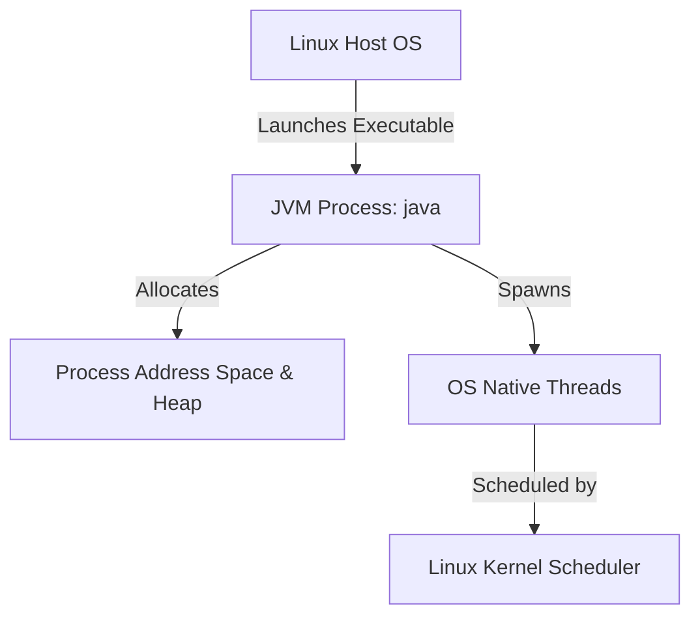

- The Java Virtual Machine executes as a standard Linux OS process.
- Java application threads map to OS execution contexts scheduled directly by the Linux kernel scheduler.
- Troubleshooting backend performance problems (high latency, thread pool exhaustion, thread blocking) requires reasoning about underlying OS process and thread scheduling states.

---

## 18. Container Preview

> [!NOTE]
> **PREVIEW - Future Topics**

- A container is **not** a virtual machine; it does not run a separate kernel or hypervisor.
- A container is a standard Linux process (or group of processes) executing on the host kernel, restricted by kernel isolation mechanisms.
- Container process isolation mechanisms (namespaces, cgroups) will be studied in future infrastructure lessons.

---

## 19. Complete Day 2 Mental Model

### Simplified Linux Process Lifecycle

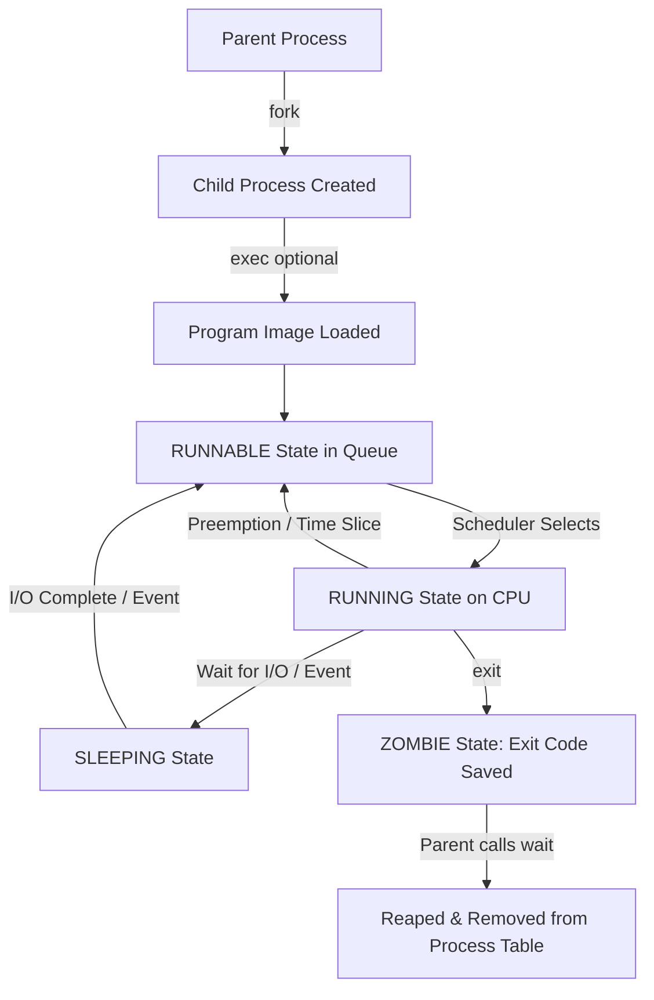

> [!NOTE]
> **Conceptual Model Disclaimer**: This is a simplified mental model, not a mandatory linear sequence for every process. Not every process calls `exec()`, not every process remains a zombie for an observable duration, and processes transition between running, runnable, and sleeping repeatedly throughout execution.

---

## 20. Backend Engineering Connection

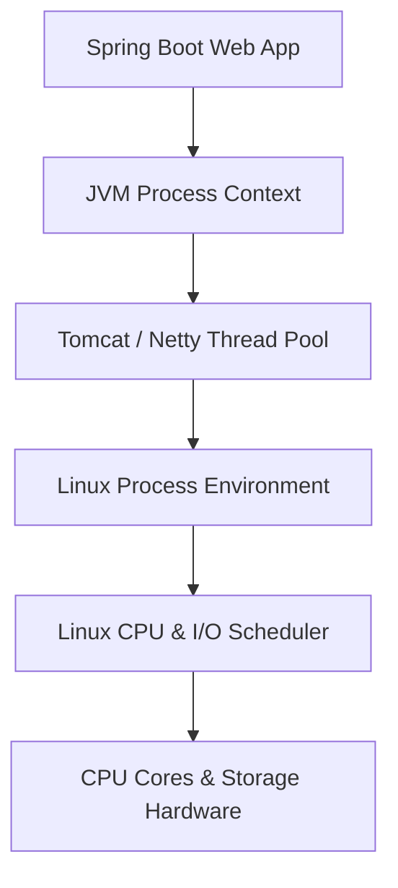

Backend engineers benefit from process-level understanding when analyzing production behavior:
- **Thread Pool Exhaustion**: High numbers of sleeping or blocked threads degrade API response latency.
- **High CPU Utilization**: Excessive runnable tasks competing for limited CPU cores cause scheduling latency spikes.
- **Resource Limits & OOM Kills**: Kernel-level resource enforcement targets individual process memory consumption.

---

## 21. Key Takeaways

1. **PID**: A integer identifier assigned by the kernel to a process instance.
2. **PPID**: Identifies the parent process that created the child process.
3. **Process Hierarchy**: Processes form a tree structure originating from root user-space initialization (PID 1 `systemd`).
4. **`fork()` Mechanics**: `fork()` creates a child process context and returns the child PID to the parent and `0` to the child.
5. **`exec()` Mechanics**: `exec()` replaces the program image within an existing process without creating a new PID.
6. **Copy-on-Write**: Deploys physical memory frame copying until a process writes to a shared page.
7. **`wait()` & `exit()`**: `exit()` terminates execution; `wait()` allows the parent to collect exit status.
8. **Zombie vs. Orphan**: Zombies are terminated children awaiting parent `wait()`; orphans are live children whose parent terminated.
9. **Running vs. Runnable**: Runnable tasks wait in run queues; running tasks actively execute on CPU cores.
10. **Sleeping State**: Suspends execution during I/O or event waiting to prevent CPU cycle waste.

---

## 22. Questions Generated

### Future Learning Questions

- What data structures does the Linux kernel maintain for each process?
- What are all official Linux process state flags in kernel source code?
- How does the Linux scheduler select among competing runnable tasks?
- What precise register and hardware context operations occur during a context switch?
- How does copy-on-write page fault handling interact with MMU page tables?
- How does virtual memory allocation change during `fork()`?
- How are Java threads mapped to Linux execution contexts?
- How do Linux namespaces isolate process views (PID, mount, network)?
- How do control groups (cgroups) limit process CPU and memory consumption?
- How do container runtimes configure process isolation boundaries?
- What operations occur inside the JVM when Java creates a new thread?
- How does JVM heap memory allocation interact with Linux process virtual memory?

---

## 23. Day 2 Status

- **Conceptual Understanding**: COMPLETED
- **`fork()` Experiment**: COMPLETED
- **PID/PPID Observation**: COMPLETED
- **Process Hierarchy Observation**: COMPLETED
- **Background Process Creation**: COMPLETED
- **Background Process PID Retrieval**: COMPLETED
- **Background Process Inspection**: NOT CONFIRMED
- **Background Process Termination with `kill`**: NOT CONFIRMED
- **`strace` Tool Installation**: COMPLETED
- **`strace` Execution Tracing**: NOT PERFORMED
- **Research Gap**: NOT ESTABLISHED
- **Research Observation**: PRELIMINARY ONLY
