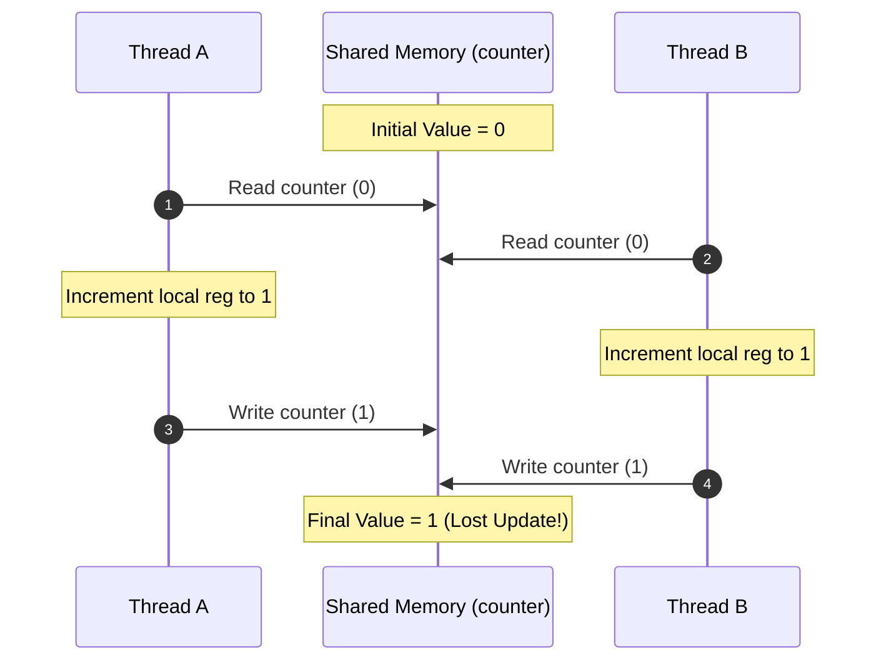
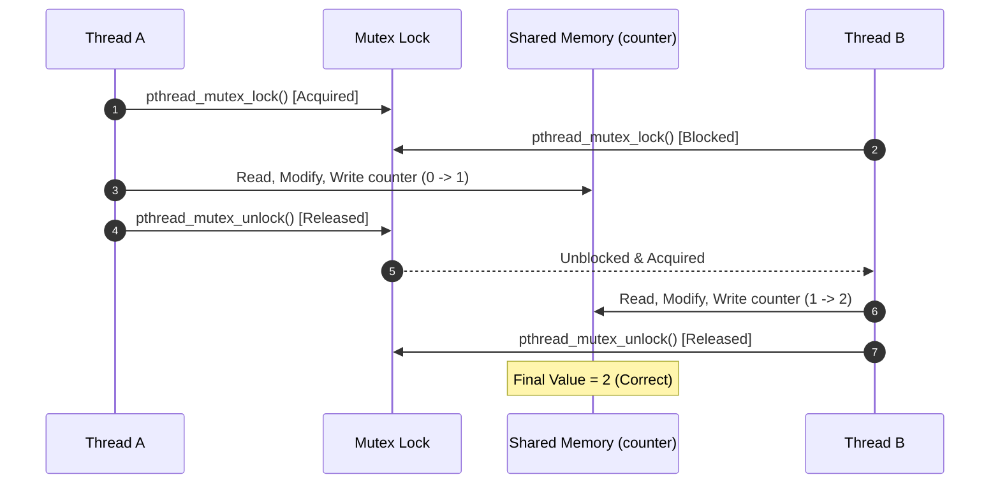

# Day 03 Experiment Record - Threads and Concurrency

> Empirical log of commands, compilation attempts, errors, runtime outputs, observations, and system interpretations.

---

## 1. System Environment

```text
Host OS:              Windows 11 (PowerShell environment)
Subsystem:            WSL2 (Windows Subsystem for Linux)
Linux Distribution:   Ubuntu 24.04.4 LTS
Kernel Version:       Linux 6.18.35.2-microsoft-standard-WSL2
Architecture:         x86_64
Compiler:             gcc (Ubuntu 13.3.0-6ubuntu2~24.04) 13.3.0
```

> **Environmental Note**: Execution took place inside a WSL2 virtualized Linux kernel environment. System behavior, scheduling granularity, and hardware virtualization layers in WSL2 may differ from bare-metal physical Linux hardware.

---

## 2. Experiment 1: Thread Creation with pthreads (`thread-demo.c`)

### 2.1 Source Code (`thread-demo.c`)
```c
#include <stdio.h>
#include <pthread.h>
#include <unistd.h>

void* worker(void* arg)
{
    printf("Worker thread: PID=%d\n", getpid());
    sleep(10);
    return NULL;
}

int main()
{
    pthread_t thread;

    printf("Main thread: PID=%d\n", getpid());

    pthread_create(&thread, NULL, worker, NULL);

    pthread_join(thread, NULL);

    return 0;
}
```

### 2.2 Initial Compilation Attempt
```bash
gcc thread-demo.c -o thread-demo -pthread
```

**Actual Compiler Error Output**:
```text
thread-demo.c: In function ‘main’:
thread-demo.c:22:5: error: expected declaration or statement at end of input
   22 |     return 0;
      |     ^~~~~~
```

* **Observation**: The compiler halted execution with a syntax error at line 22.
* **Interpretation**: The source code had a missing closing brace `}` at the end of the `main()` function block.
* **Status**: **FAILED FIRST ATTEMPT** (Source syntax error).

### 2.3 Corrected Compilation and Execution
The missing closing brace was added to `thread-demo.c`.

```bash
gcc thread-demo.c -o thread-demo -pthread
./thread-demo
```

**Actual Execution Output**:
```text
Main thread: PID=1811
Worker thread: PID=1811
```

* **Observation**: Both the main thread and worker thread output `PID=1811`.
* **Interpretation**: Both execution paths run inside the same Linux process address space.
* **Experimental Boundary**: This output proves shared process identity (`PID`), but does not display individual OS Thread IDs (`TID`).
* **Status**: **COMPLETED**.

---

## 3. Experiment 2: Background Thread Execution

### 3.1 Background Command
```bash
./thread-demo &
```

**Actual Execution Output**:
```text
[2] 1813
Main thread: PID=1813
Worker thread: PID=1813
```

### 3.2 Process Identifier Check
```bash
echo $!
```

**Actual Execution Output**:
```text
1813
```

* **Observation**: The background job started under process ID `1813`.
* **Interpretation**: The shell recorded `1813` as the PID of the background process. However, because `thread-demo` called `sleep(10)` and then joined, the program finished within 10 seconds. The shell emitted `[2]- Done ./thread-demo` before the next command was executed.
* **Status**: **COMPLETED**.

---

## 4. Experiment 3: Attempted Thread Inspection with `ps -T`

### 4.1 Inspection Command
```bash
ps -T -p 1813
```

**Actual Execution Output**:
```text
    PID    SPID TTY          TIME CMD
```

* **Observation**: The command printed column headers (`PID`, `SPID`, `TTY`, `TIME`, `CMD`), but returned zero process or thread rows.
* **Interpretation**: The target process (`PID 1813`) had already exited by the time `ps -T` executed.
* **Status**: **INCONCLUSIVE / INSUFFICIENT OBSERVATION**.

> **Crucial Methodological Finding**: The intended thread inspection could **not** be completed because the target process had already exited. We do **not** claim `ps -T` displayed thread IDs for `thread-demo`. Time management and process lifetime are critical variables when observing transient system state.

---

## 5. Experiment 4: System Thread Observation with `pstree`

### 5.1 System Process Tree Command
```bash
pstree
```

**Actual Relevant System Output**:
```text
systemd─┬─agetty
        ├─containerd───8*[{containerd}]
        ├─cron
        ├─dbus-daemon
        ├─dockerd───9*[{dockerd}]
        ├─init-systemd(Ub─┬─SessionLeader───Relay(563)───bash─┬─pstree
        │                 │                                   └─top
        ...
        ├─polkitd───3*[{polkitd}]
        ├─rsyslogd───3*[{rsyslogd}]
        ...
```

* **Observation**: `pstree` displayed background daemon processes containing thread notations such as `8*[{containerd}]` (8 threads) and `9*[{dockerd}]` (9 threads).
* **Interpretation**: The Linux kernel and OS userspace actively manage multithreaded processes.
* **Experimental Boundary**: These thread entries belong to existing system services (`containerd`, `dockerd`), **not** to our experimental `thread-demo` program.
* **Status**: **COMPLETED**.

---

## 6. Experiment 5: Race Condition Demonstration (`race.c`)

### 6.1 Source Code (`race.c`)
```c
#include <stdio.h>
#include <pthread.h>

int counter = 0;

void* increment(void* arg)
{
    for (int i = 0; i < 1000000; i++)
    {
        counter++;
    }

    return NULL;
}

int main()
{
    pthread_t t1, t2;

    pthread_create(&t1, NULL, increment, NULL);
    pthread_create(&t2, NULL, increment, NULL);

    pthread_join(t1, NULL);
    pthread_join(t2, NULL);

    printf("Counter = %d\n", counter);

    return 0;
}
```

### 6.2 Compilation & Execution Run 1
```bash
gcc race.c -o race -pthread
./race
```

**Actual Output (Run 1)**:
```text
Counter = 1332724
```

### 6.3 Compilation & Execution Run 2
```bash
gcc race.c -o race -pthread
./race
```

**Actual Output (Run 2)**:
```text
Counter = 2000000
```

### 6.4 Analytical Evaluation
* **Expected Logical Result**: $2 \text{ threads} \times 1,000,000 \text{ iterations} = 2,000,000$.
* **Run 1 Result (`1332724`)**: Demonstrates a lost-update race condition caused by unsynchronized concurrent access to `counter++`.
* **Run 2 Result (`2000000`)**: Demonstrates that a race condition is nondeterministic. The expected result of `2000000` in Run 2 does **not** disprove the race condition; it shows that under specific OS scheduling conditions, thread interleavings coincidentally did not overlap during memory updates.
* **Status**: **COMPLETED**.

---

## 7. Experimental Limitations

1. **Recorded Runs**: Exactly **two** executions of `race.c` were performed and recorded (`1332724` and `2000000`).
2. **Lack of Benchmarking**: No multi-run statistical sample, automated loop test, CPU core affinity pinning, or scheduling policy modification was performed.
3. **Scope Limit**: This experiment demonstrates the *presence of nondeterminism* in unsynchronized shared memory access. It does not establish quantitative performance characteristics.

---

## 8. Mutex Synchronization (Conceptual Fix Only)

To prevent lost updates, access to shared state can be protected by a mutex lock:

```c
// Conceptual Synchronization Solution (NOT experimentally executed in Day 03)
pthread_mutex_t lock = PTHREAD_MUTEX_INITIALIZER;

void* increment_safe(void* arg)
{
    for (int i = 0; i < 1000000; i++)
    {
        pthread_mutex_lock(&lock);
        counter++;
        pthread_mutex_unlock(&lock);
    }
    return NULL;
}
```

> **Experimental Note**: This code snippet represents a conceptual synchronization solution. It was **not** compiled or executed in the Day 03 experimental session. No empirical output (such as an observed `2000000` from a mutex run) is claimed.

---

## 9. Experiment Summary Table

| # | Experiment | Actual Result | Underlying Systems Concept | Status |
| :--- | :--- | :--- | :--- | :--- |
| **1** | `thread-demo.c` Initial Compilation | Compilation Error (missing `}`) | Compiler C syntax verification | **Failed First Attempt** |
| **2** | `thread-demo.c` Fixed Compilation | Clean binary generation | `pthread` library compilation | **Completed** |
| **3** | `thread-demo` Foreground Execution | Main PID=1811, Worker PID=1811 | Shared process address space | **Completed** |
| **4** | `thread-demo &` Background Job | Job `[2] 1813` created and completed | Process execution lifecycle | **Completed** |
| **5** | `ps -T -p 1813` Thread Inspection | Header only (0 process rows) | Transient process lifetime & inspection timing | **Inconclusive** |
| **6** | `pstree` System Inspection | `containerd (8)` and `dockerd (9)` threads | OS-level multithreaded daemon processes | **Completed** |
| **7** | `race.c` Execution Run 1 | `Counter = 1332724` | Shared mutable state lost updates | **Completed** |
| **8** | `race.c` Execution Run 2 | `Counter = 2000000` | Nondeterministic manifestation of race conditions | **Completed** |

---

## 10. Mistakes and Lessons Learned

### Mistake 1: Missing Source Closing Brace
* **Symptom**: `gcc` reported `error: expected declaration or statement at end of input`.
* **Root Cause**: Missing closing brace `}` in `main()`.
* **Lesson**: Compiler diagnostics flag syntax structure errors before code can be translated into machine instructions.

### Mistake 2: Late Inspection of Short-Lived Process
* **Symptom**: `ps -T -p 1813` returned no thread records.
* **Root Cause**: The 10-second sleep interval completed before the user issued the inspection command.
* **Lesson**: Systems experiments are strictly time-sensitive. Monitoring transient state requires synchronized inspection during process lifetime.

---

## 11. Observation vs Interpretation

| Observation (Fact) | Empirical Evidence | System Interpretation |
| :--- | :--- | :--- |
| Main and worker threads printed identical PID `1811`. | Terminal output from `./thread-demo`. | Both threads execute within the same process context. |
| PID `1813` produced no rows under `ps -T`. | Empty result from `ps -T -p 1813`. | The target process terminated before inspection occurred. |
| `pstree` showed `9*[{dockerd}]`. | Output line from `pstree`. | The system contains background processes operating multiple threads. |
| `race` output changed across executions (`1332724` vs `2000000`). | Console output of Run 1 and Run 2. | Unsynchronized access to shared state produces nondeterministic outcomes. |

---

## 12. Structural Visualizations

### Interleaving Diagram: Lost Update Race Condition


### Mutex Synchronization Sequence


---

## 13. Research Discipline

* **Research Gap**: *Not Established*.
* **Research Claim**: *None*.
* **Status**: *Preliminary Engineering Observation*.
* **Future Requirement**: Controlled multi-core benchmarking, hardware cache-coherence tracing, and formal literature analysis before making architectural or academic claims.
