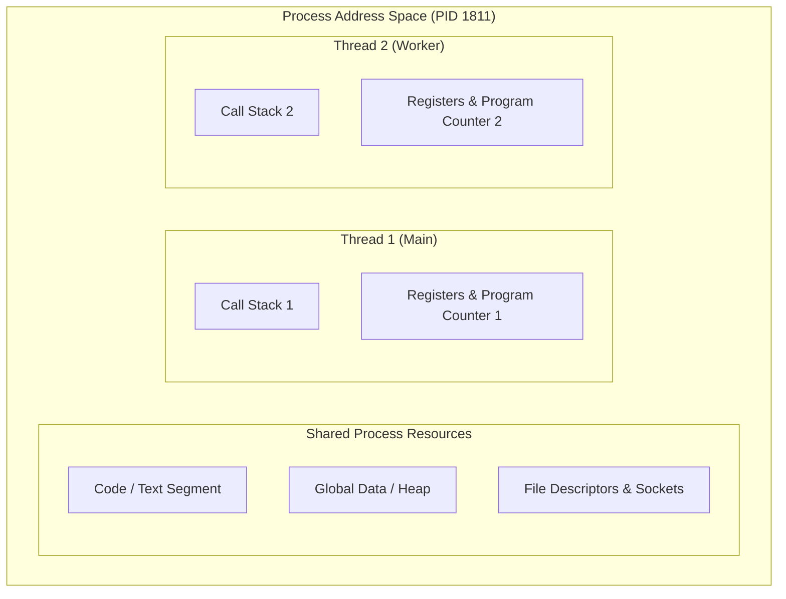
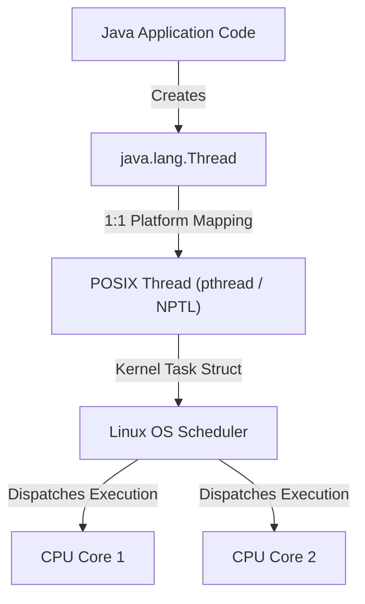

# Day 03 - Threads and Concurrency

> How multiple execution paths operate inside a process, and why shared state makes concurrency difficult.

---

## 1. Objective

The primary objective of Day 03 is to answer the fundamental systems question:

> **If a process can contain multiple threads, what exactly is a thread, why do we need concurrency, and what problems appear when threads share state?**

Day 02 established the **Linux Process Model**: how the operating system provides resource isolation, memory protection, unique process identifiers (`PID`/`PPID`), and process lifecycle management via `fork()`, `exec()`, `wait()`, and `exit()`.

Day 03 transitions from process-level isolation reasoning to execution-level concurrency reasoning:

```text
Day 02 (Process Level)

Process
│
├── PID / PPID
├── Address Space Isolation
├── fork() / exec()
└── Process Lifecycle


Day 03 (Execution Level)

Process
│
├── Thread A
├── Thread B
└── Thread C
       ↓
Concurrent execution
       ↓
Shared state
       ↓
Race conditions
       ↓
Synchronization (Locks / Mutexes)
```

While Day 02 treated the process as a single monolithic execution entity, Day 03 examines how multiple execution paths operate within a single process address space.

---

## 2. What is a Thread?

A **thread** (or thread of execution) is the smallest unit of execution context within a process that can be scheduled by an operating system scheduler.

```text
Process Context
│
├── Shared Process Resources
│   ├── Code / Text Segment
│   ├── Global / Static Data (BSS)
│   ├── Dynamic Heap Memory
│   ├── File Descriptors (Open files, sockets)
│   └── System Environment & Working Directory
│
└── Thread-Specific Execution State
    ├── Thread 1: [ Program Counter 1 | Registers 1 | Call Stack 1 ]
    ├── Thread 2: [ Program Counter 2 | Registers 2 | Call Stack 2 ]
    └── Thread 3: [ Program Counter 3 | Registers 3 | Call Stack 3 ]
```

### Shared Process Resources
All threads belonging to the same process share access to:
* **Code Segment**: Executable CPU instructions of the program.
* **Heap Memory**: Dynamically allocated memory (`malloc`, `new`).
* **Global and Static Variables**: Process-wide mutable state.
* **File Descriptors**: Open files, network sockets, pipes.
* **Process Credentials & Environment**: User ID, group ID, working directory.

### Thread-Specific Execution State
Each thread maintains its own independent execution state:
* **Program Counter (PC)**: Points to the current CPU instruction being executed by that thread.
* **CPU Registers**: Working registers holding intermediate calculation values.
* **Call Stack**: Private memory stack storing local function parameters, local variables, and return addresses.
* **Thread ID & Scheduling State**: Unique identifier and priority state managed by the OS scheduler.

---

## 3. Process vs Thread

The distinction between a process and a thread is fundamentally about **isolation boundaries** and **resource ownership**.

| Property | Process | Thread |
| :--- | :--- | :--- |
| **Resource Context** | Owns independent process resource context | Shares parent process resource context |
| **Address Space** | Isolated address space enforced by OS/MMU | Shares address space with all threads in same process |
| **Execution Path** | Container holding one or more execution threads | Represents a single sequential execution path |
| **Communication** | Requires explicit IPC (pipes, sockets, shared memory) | Shared memory naturally accessible via pointers |
| **Isolation** | Strong memory protection boundary | Weaker boundary; shared memory allows cross-thread corruption |
| **Failure Impact** | Process crash is isolated from other processes | A severe fault (e.g., SIGSEGV) can terminate the entire process |

> **Note on Failure Impact**: While a thread crash caused by an unhandled signal (such as a segmentation fault) typically terminates the host process, modern runtimes (like Java JVMs) may handle certain thread-level exceptions without process termination. However, memory corruption caused by a buggy thread can silently affect all other threads in the same process.

---

## 4. Why Threads Exist

In a single-threaded execution model, a process can perform only one operation at a time. If an operation blocks on I/O (such as disk read or network socket read), the entire process halts until the operation completes.

### Single Execution Path (Blocking)
```text
Request A ───> [ Network I/O Wait ] ───> Request B ───> [ Disk I/O Wait ] ───> Request C
```

### Multiple Execution Threads (Concurrent Progress)
```text
Thread 1: Request A ───> [ Network I/O Wait ] ───> Complete
Thread 2: Request B ──────> [ Compute ] ─────────> Complete
Thread 3: Request C ─────────> [ Disk I/O Wait ] ─> Complete
```

### Purpose of Multithreading
Threads enable an application to:
1. **Improve Responsiveness**: Keep user interfaces or control loops active while background threads perform long-running work.
2. **Increase Throughput**: Overlap I/O wait times with CPU computation across multiple requests.
3. **Utilize Multi-Core Hardware**: Execute multiple tasks in parallel across multiple physical CPU cores.

> **Important Distinction**: Threads do **not** automatically make programs faster. For CPU-bound workloads on a single core, context switching overhead can make multithreaded execution slower than sequential execution. Threads improve efficiency based on workload characteristics and system capacity.

---

## 5. Concurrency vs Parallelism

Concurrency and parallelism are related but distinct computer systems concepts.

```text
Concurrency (Interleaving on 1 Core)

Time ──────────────────────────────────────────────────────────►
Core 1: | Task A | Task B | Task A | Task C | Task B | Task A |


Parallelism (Simultaneous Execution on Multiple Cores)

Time ──────────────────────────────────────────────────────────►
Core 1: | Task A | Task A | Task A | Task A | Task A | Task A |
Core 2: | Task B | Task B | Task B | Task B | Task B | Task B |
Core 3: | Task C | Task C | Task C | Task C | Task C | Task C |
```

### Summary Comparison

| Concept | Meaning | Hardware Requirement |
| :--- | :--- | :--- |
| **Concurrency** | Managing and interleaving multiple tasks over overlapping time frames | Can run on a single CPU core via execution context switching |
| **Parallelism** | Executing multiple tasks simultaneously at the exact same physical instant | Requires multiple physical execution units (multi-core CPUs) |

* **Key Takeaway**: Concurrency is about *structure* (decomposing a program into independent execution units). Parallelism is about *execution* (running multiple units simultaneously on physical hardware). Concurrency does not require multiple CPU cores.

---

## 6. Threads Share Process Resources

The power and danger of multithreading stem directly from shared process memory.

```text
+-------------------------------------------------------------------+
| Process Memory Address Space                                      |
|                                                                   |
|  +---------------------+  +--------------------+  +-------------+ |
|  | Text / Code Segment |  | Data / BSS Segment |  | Heap Memory | |
|  +---------------------+  +--------------------+  +-------------+ |
|                                                                   |
|  Shared Resources: File Descriptors, Sockets, Environment         |
|                                                                   |
|  +-------------------------+      +-------------------------+     |
|  | Thread 1 Stack          |      | Thread 2 Stack          |     |
|  | - Local variables       |      | - Local variables       |     |
|  | - Function frames       |      | - Function frames       |     |
|  +-------------------------+      +-------------------------+     |
+-------------------------------------------------------------------+
```

Because threads share the global data and heap memory, any thread can read or modify a shared variable allocated on the heap or global memory space.

---

## 7. The Core Problem: Shared State

Consider a simple shared counter variable shared between two threads:

```c
int counter = 0;

// Executed concurrently by Thread A and Thread B:
counter++;
```

At the machine code level, `counter++` is **not an atomic instruction**. It expands into three distinct CPU operations:

```text
1. Read:   Fetch 'counter' value from memory into a CPU register.
2. Modify: Increment the register value by 1.
3. Write:  Store the updated register value back into memory.
```

### Unsynchronized Collision Mechanics
```text
Thread A                            Thread B                            Memory (counter)
────────                            ────────                            ────────────────
Read counter (0)                                                        0
                                    Read counter (0)                    0
Modify (0 + 1 = 1)                                                      0
                                    Modify (0 + 1 = 1)                  0
Write counter (1) ────────────────────────────────────────────────────► 1
                                    Write counter (1) ────────────────► 1  <-- Lost Update!
```

Both threads performed an increment operation, but because their Read-Modify-Write cycles overlapped, the final value in memory became `1` instead of the expected `2`.

---

## 8. Interleaving

When multiple threads execute concurrently, the operating system scheduler decides when to switch execution between threads. The resulting sequence of instructions across all threads is called an **interleaving**.

If Thread A executes instructions $\{A1, A2, A3\}$ and Thread B executes $\{B1, B2, B3\}$, valid interleavings include:

```text
Interleaving 1:  A1 -> A2 -> A3 -> B1 -> B2 -> B3  (Sequential)
Interleaving 2:  A1 -> B1 -> A2 -> B2 -> A3 -> B3  (Interleaved)
Interleaving 3:  B1 -> B2 -> A1 -> A2 -> B3 -> A3  (Interleaved)
```

### Systems Implication
A concurrent program may have thousands of possible interleavings depending on thread timing, OS scheduling, and CPU load. If program correctness relies on one specific execution order out of many, the program contains a nondeterministic concurrency defect.

---

## 9. Race Condition

> **Definition**: A **race condition** occurs when the correctness or output of a concurrent computation depends on the relative timing or interleaving of concurrent execution paths.

In Day 03 experiments, unsynchronized increment operations on a shared variable produced two different results across identical executions:
* **Run 1**: `Counter = 1332724` (Lost updates occurred)
* **Run 2**: `Counter = 2000000` (Interleaving happened not to overlap lost updates)

This empirical evidence demonstrates that race conditions introduce nondeterministic behavior into software systems.

---

## 10. Critical Section

A **critical section** is a sequence of instructions that accesses a shared mutable resource (such as shared memory) and must not be concurrently executed by more than one thread at a time.

```text
Thread A                             Thread B
────────                             ────────
Enter Critical Section (Acquires Mutex)
Modifies Shared State                Tries to enter Critical Section
Exits Critical Section (Releases)    Blocked waiting for Mutex...
                                     Acquires Mutex & Enters Critical Section
```

To prevent race conditions, execution inside a critical section must be coordinated using synchronization primitives.

---

## 11. Mutex (Mutual Exclusion)

A **mutex** (short for mutual exclusion lock) is a synchronization primitive used to enforce that only one thread can execute within a critical section at any given time.

### Conceptual Operations
* **`lock()`**: Attempts to acquire the mutex. If the mutex is unlocked, the thread acquires it and enters the critical section. If it is already locked by another thread, the calling thread blocks until the lock is released.
* **`unlock()`**: Releases ownership of the mutex, unblocking any waiting thread.

---

## 12. Simplified Thread Lifecycle

To reason about thread behavior conceptually, we use a simplified thread lifecycle model:

```text
             +---------+
             | Created |
             +----+----+
                  |
                  | pthread_create() / start()
                  v
             +---------+  OS Scheduler Selects   +---------+
    +------->| Runnable| ----------------------> | Running |
    |        +----+----+                         +----+----+
    |             ^                                   |
    |             | Lock Released / I/O Ready         | Wait / Lock Contention / I/O
    |        +----+----+                              |
    +--------| Blocked | <----------------------------+
             +---------+
                                                      | Thread Function Returns
                                                      v
                                                 +------------+
                                                 | Terminated |
                                                 +------------+
```

> **Important Boundary Note**: This conceptual lifecycle illustrates general thread scheduling states. Java's high-level `Thread.State` enum (`NEW`, `RUNNABLE`, `BLOCKED`, `WAITING`, `TIMED_WAITING`, `TERMINATED`) and the Linux kernel's execution states (`TASK_RUNNING`, `TASK_INTERRUPTIBLE`, `TASK_UNINTERRUPTIBLE`) represent specific implementation abstractions at different layers.

---

## 13. OS Threads and Java Threads

In modern enterprise server architectures, application code (such as Java applications) runs inside a host process (the JVM).

```text
+--------------------------------------------------------------------+
| JVM Process (java)                                                 |
|                                                                    |
|  Java Application Code (Thread t = new Thread(...))               |
|                                                                    |
|  Java Platform Thread Object (java.lang.Thread)                    |
|       │                                                            |
|       ▼ (1:1 Native Mapping via NPTL on Linux)                    |
|  Native OS Thread (pthread / task_struct)                          |
+-------│------------------------------------------------------------+
        │
        ▼ Scheduled by Linux Kernel
+--------------------------------------------------------------------+
| Hardware Execution Core (CPU)                                      |
+--------------------------------------------------------------------+
```

### Core Connections
1. A Java application operates as a standard Linux userspace process.
2. Standard Java platform threads (`java.lang.Thread`) map 1:1 to native Linux POSIX threads (`pthread`) managed by the operating system kernel.
3. Thread creation, scheduling, and context switching incur OS-level memory and CPU resource overheads.

---

## 14. Actual Day 02 Connection

During Day 02 process tree observations using `pstree`, the system reported process entries containing bracketed child entries:

```text
dockerd(311)
├─{dockerd}(314)
├─{dockerd}(315)
├─{dockerd}(316)
...

containerd(221)
├─{containerd}(236)
├─{containerd}(237)
...
```

### Interpretation
In Day 02, these entries were observed as part of process hierarchy inspection. Day 03 provides the theoretical and execution framework to understand that `{dockerd}` and `{containerd}` entries represent individual lightweight execution threads belonging to those daemon processes.

> **Crucial Distinction**: These were existing multithreaded daemon processes in the WSL2 system environment, not threads created by our experimental programs.

---

## 15. Day 03 Experiment 1: thread-demo

### Source Code (`thread-demo.c`)
```c
#include <stdio.h>
#include <pthread.h>
#include <unistd.h>

void* worker(void* arg)
{
    printf("Worker thread: PID=%d\n", getpid());
    sleep(10);
    return NULL;
}

int main()
{
    pthread_t thread;

    printf("Main thread: PID=%d\n", getpid());

    pthread_create(&thread, NULL, worker, NULL);

    pthread_join(thread, NULL);

    return 0;
}
```

### Initial Compilation Attempt
```bash
gcc thread-demo.c -o thread-demo -pthread
```
**Compilation Error**:
```text
thread-demo.c: In function ‘main’:
thread-demo.c:22:5: error: expected declaration or statement at end of input
   22 |     return 0;
      |     ^~~~~~
```
**Diagnosis**: Syntax error in source file due to a missing closing brace `}` at the end of `main()`.

### Corrected Compilation & Execution
```bash
gcc thread-demo.c -o thread-demo -pthread
./thread-demo
```
**Output**:
```text
Main thread: PID=1811
Worker thread: PID=1811
```

### Observation & Interpretation
Both the main thread and worker thread printed `PID=1811`. This confirms that both threads execute within the address space of the exact same OS process. This output demonstrates shared process context, but does not explicitly expose individual Linux Thread IDs (TIDs).

---

## 16. Background Thread Experiment

### Execution Command
```bash
./thread-demo &
```
**Output**:
```text
[2] 1813
Main thread: PID=1813
Worker thread: PID=1813
```

### Inspection Command
```bash
echo $!
```
**Output**:
```text
1813
```

### Observation & Interpretation
The background process started under PID 1813. The program contained `sleep(10)` followed by `pthread_join()`. By the time interactive inspection commands were issued in the terminal, 10 seconds had elapsed and the shell reported:
```text
[2]- Done ./thread-demo
```
The target process completed execution and exited before thread-level inspection could take place.

---

## 17. ps -T Experiment

### Inspection Command
```bash
ps -T -p 1813
```

### Output
```text
    PID    SPID TTY          TIME CMD
```

### Observation & Interpretation
No process or thread rows were returned by `ps -T`.

* **Status**: **INSUFFICIENT / INCONCLUSIVE OBSERVATION**.
* **Systems Lesson**: The inspection command failed to display individual thread rows because process `1813` had already terminated prior to running `ps -T`.
* **Methodological Conclusion**: Systems experiments are strictly time-sensitive. Observing transient execution state requires active monitoring during the target process lifecycle.

---

## 18. pstree Experiment During Day 03

### Execution Command
```bash
pstree
```

### Relevant System Output
```text
systemd─┬─agetty
        ├─containerd───8*[{containerd}]
        ├─cron
        ├─dbus-daemon
        ├─dockerd───9*[{dockerd}]
        ├─init-systemd(Ub─┬─SessionLeader───Relay(563)───bash─┬─pstree
        │                 │                                   └─top
        ...
        ├─polkitd───3*[{polkitd}]
        ├─rsyslogd───3*[{rsyslogd}]
        ...
```

### Observation & Interpretation
`pstree` confirmed that active background system daemons (such as `containerd` with 8 threads and `dockerd` with 9 threads) run as multithreaded processes inside the Linux kernel environment.

---

## 19. Race Condition Experiment

### Source Code (`race.c`)
```c
#include <stdio.h>
#include <pthread.h>

int counter = 0;

void* increment(void* arg)
{
    for (int i = 0; i < 1000000; i++)
    {
        counter++;
    }

    return NULL;
}

int main()
{
    pthread_t t1, t2;

    pthread_create(&t1, NULL, increment, NULL);
    pthread_create(&t2, NULL, increment, NULL);

    pthread_join(t1, NULL);
    pthread_join(t2, NULL);

    printf("Counter = %d\n", counter);

    return 0;
}
```

### Compilation & Execution
```bash
gcc race.c -o race -pthread
./race
```

### Output Across Executions
* **Run 1 Output**: `Counter = 1332724`
* **Run 2 Output**: `Counter = 2000000`

### Mathematical Analysis
* Expected total increments: $2 \text{ threads} \times 1,000,000 \text{ iterations} = 2,000,000$.
* **Run 1 Result (1,332,724)**: Proves that unsynchronized concurrent access caused $667,276$ lost updates due to overlapping Read-Modify-Write cycles.
* **Run 2 Result (2,000,000)**: Does **not** disprove the existence of the race condition. It demonstrates that nondeterministic thread scheduling can occasionally produce the expected value if thread execution interleavings happen not to overlap during memory writes.

---

## 20. Race Condition Analysis

```text
Conceptual Example of a Problematic Interleaving:

Initial State: counter = 0

Time  Thread A                        Thread B                        Memory (counter)
───   ────────                        ────────                        ────────────────
T1    Read counter (0) into RegA                                      0
T2                                    Read counter (0) into RegB      0
T3    Increment RegA to 1                                             0
T4                                    Increment RegB to 1             0
T5    Write RegA (1) to memory ─────────────────────────────────────► 1
T6                                    Write RegB (1) to memory ──────► 1 (Lost Update!)
```

This conceptual trace shows how two distinct increment operations collapsed into a single net increment in memory.

---

## 21. Important Experimental Limitation

1. **Sample Size**: Only **two** executions of `race.c` were recorded (`1332724` and `2000000`).
2. **Benchmark Scope**: No controlled multi-run performance benchmark, CPU affinity pinning, or statistical variance sampling was conducted.
3. **Conclusion Boundary**: These observations demonstrate the **nondeterministic manifestation** of race conditions in shared-state concurrency. They do not constitute a quantitative performance or scheduling benchmark.

---

## 22. Mutex and Race Fix (Conceptual)

To guarantee thread-safe increment operations, access to `counter++` must be protected by a mutex lock:

```c
// Conceptual Synchronization Solution (Not experimentally executed in Day 03)
pthread_mutex_t lock = PTHREAD_MUTEX_INITIALIZER;

void* increment_safe(void* arg)
{
    for (int i = 0; i < 1000000; i++)
    {
        pthread_mutex_lock(&lock);
        counter++;
        pthread_mutex_unlock(&lock);
    }
    return NULL;
}
```

> **Experimental Note**: This synchronization solution was taught conceptually in Day 03. It was **not** compiled or executed during the Day 03 session, and no empirical output is claimed for the mutex version.

---

## 23. Deadlock Preview

When multiple threads acquire multiple mutex locks in different orders, a **deadlock** can occur.

```text
Thread A                            Thread B
────────                            ────────
Acquires Lock 1                     Acquires Lock 2
Attempts to acquire Lock 2 (Waits)  Attempts to acquire Lock 1 (Waits)
      │                                   │
      └──────────────► DEADLOCK ◄─────────┘
```

### The Four Coffman Deadlock Conditions
1. **Mutual Exclusion**: Resources cannot be shared simultaneously.
2. **Hold and Wait**: A thread holds a resource while requesting another.
3. **No Preemption**: Resources cannot be forcibly taken from a thread.
4. **Circular Wait**: A closed chain of threads exists where each waits for a resource held by the next.

> **Status**: Marked as a *Future Concurrency Topic*.

---

## 24. Backend Engineering Connection

In web servers (such as Spring Boot, Netty, or Node.js worker pools), incoming HTTP network requests are handled concurrently using thread pools:

```text
Client Request 1 ───► [ Worker Thread 1 ] ──┐
Client Request 2 ───► [ Worker Thread 2 ] ──┼──► Shared Database / In-Memory Cache
Client Request 3 ───► [ Worker Thread 3 ] ──┘
```

### Core Backend Concerns
* **Thread Safety**: Ensuring shared service singletons and caches handle concurrent access without state corruption.
* **Lock Contention**: High thread counts waiting on a single mutex reduce server throughput.
* **Resource Exhaustion**: Creating unmanaged threads can exhaust kernel memory and thread stack limits.

---

## 25. Day 03 Mental Model

### Conceptual Model: Process vs Threads


### System Architecture View: Java to OS Hardware


---

## 26. Key Takeaways

1. **Resource Ownership**: A process owns memory and resources; a thread represents an execution path within a process.
2. **Shared Memory**: Threads within the same process share heap memory, global variables, and file descriptors.
3. **Thread Execution Context**: Each thread maintains its own private program counter, CPU registers, and call stack.
4. **Concurrency vs Parallelism**: Concurrency is interleaving tasks over time (single core); parallelism is simultaneous hardware execution (multi-core).
5. **Non-Atomic Operations**: High-level statements like `counter++` consist of multiple Read-Modify-Write machine steps.
6. **Race Conditions**: Unsynchronized shared-state access leads to nondeterministic timing-dependent execution bugs.
7. **Interleaving**: Concurrent execution produces unpredictable instruction sequences across threads.
8. **Critical Sections**: Code modifying shared state must be protected to ensure mutual exclusion.
9. **Mutex Protection**: Mutex locks enforce that only one thread executes inside a critical section at a time.
10. **OS Mapping**: Standard Java platform threads map 1:1 to native Linux kernel execution threads via NPTL.
11. **Time-Sensitive Observation**: Observing transient processes requires precise timing before target process exit.
12. **Empirical Nondeterminism**: Identical code executions can yield different outputs under race conditions (`1332724` vs `2000000`).

---

## 27. Questions Generated (Future Learning Questions)

1. *How does the Linux kernel represent threads internally within `task_struct`?*
2. *What is the exact kernel distinction between PID, TID, and SPID in Linux process tools?*
3. *How does the Linux CFS/EEVDF scheduler handle thread scheduling priorities?*
4. *What hardware actions occur during a thread CPU context switch?*
5. *How do atomic hardware instructions (e.g., CMPXCHG) bypass mutex locking overhead?*
6. *What guarantees does the Java Memory Model (JMM) provide regarding visibility and reordering?*
7. *What exact memory barrier instructions are emitted by the `volatile` keyword in Java?*
8. *How do operating system kernels implement mutex sleep and wakeup mechanisms (e.g., futex)?*
9. *What conditions cause deadlocks and how can static analysis detect them?*
10. *How do Java thread pools manage thread creation, queueing, and task rejection?*
11. *How do Java Virtual Threads differ from traditional 1:1 platform threads?*
12. *How does thread lock contention impact backend request latency under heavy load?*
13. *How do CPU L1/L2/L3 caches and store buffers affect memory visibility across threads?*
14. *How do application-level threads interact with database transaction isolation levels?*

---

## 28. Research Relevance

### Preliminary Engineering Observation
> **Statement**: Unsynchronized concurrent access to shared mutable state introduces nondeterministic behavior and lost updates that cannot be detected from sequential static code analysis alone.

* **Supporting Evidence**:
  1. `thread-demo` demonstrated concurrent threads sharing process PID `1811`.
  2. `race.c` produced `Counter = 1332724` (lost updates) on Run 1 and `Counter = 2000000` on Run 2 under identical code binaries.
  3. `pstree` confirmed existing multithreaded system processes in the OS environment.
* **Current Status**: *Preliminary Engineering Observation*.
* **Validation Requirement**: Requires future controlled multi-core benchmark experiments, CPU cache line analysis, and formal memory model literature review.
* **Novelty / Research Gap Claim**: None claimed.
